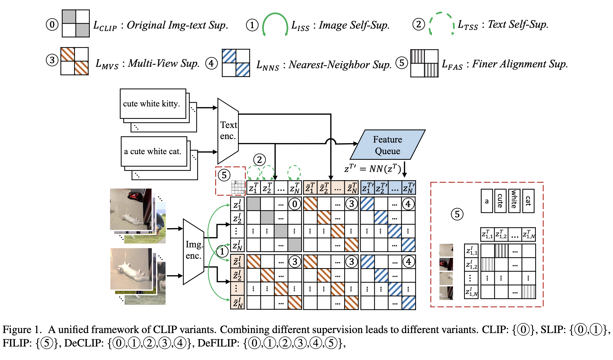

<!-- # DeCLIP
Supervision Exists Everywhere: A Data Efficient Contrastive Language-Image Pre-training Paradigm.

Our paper is available on [arxiv](https://arxiv.org/abs/2110.05208) -->


# [Supervision Exists Everywhere: A Data Efficient Contrastive Language-Image Pre-training Paradigm.](https://arxiv.org/abs/2110.05208)

DeCLIP is an open-source project that welcomes any contribution and feedback. We wish that the toolbox and benchmark could serve the growing research community by providing a flexible as well as a standardized toolkit to reimplement existing methods and develop their own new Contrastive Language-Image Pretraining methods. You can find the following things in this repo:
+ Pre-trained models and training codes to reproduce various Contrastive Language-Image Pretraining methods(e.g. CLIP, DeCLIP, SLIP, FILIP).
+ Various benchmark datasets for Large-scale Contrastive Language-Image Pretraining task.
+ Zero-shot transfer and linear classification evaluation scripts for downstream datasets.

We aims to democratize large-scale CLIP to build a fair and reproducible CLIP community. Our paper are available on:

**DeCLIP**: [Supervision Exists Everywhere: A Data Efficient Contrastive Language-Image Pre-training Paradigm](https://arxiv.org/abs/2110.05208).

**CLIP-Benchmark**: [Democratizing Contrastive Language-Image Pre-training: A CLIP Benchmark of Data, Model, and Supervision](https://arxiv.org/abs/2203.05796).


## Call for Papers & Participation

:loudspeaker: **Call for Papers & Participation**: ECCV Workshop and Challenge on [Computer Vision in the Wild (CVinW)](https://computer-vision-in-the-wild.github.io/eccv-2022/)


<table>
  <tr>
    <td style="width:220px">  <center><a href="https://computer-vision-in-the-wild.github.io/eccv-2022/">   [Workshop]</a>  </center> </td>
    <td style="width:220px"> <center><a href="https://eval.ai/web/challenges/challenge-page/1832/overview"> [IC Challenge]</a>   </center> </td>
    <td style="width:220px">  <center><a href="https://eval.ai/web/challenges/challenge-page/1839/overview"> [OD Challenge]</a>  </center> </td>
  </tr>
</table>

## Introduction

Recently, large-scale Contrastive Language-Image Pre-training (CLIP) (Radfordet al., 2021) has attracted unprecedented attention for its impressive zero-shot recognition ability and excellent transferability to downstream tasks. However, CLIP is quite data-hungry and requires 400M image-text pairs for pre-training, thereby restricting its adoption. This work proposes a novel training paradigm, Data efficient CLIP (DeCLIP), to alleviate this limitation. We demonstrate that by carefully utilizing the widespread supervision among the image-text pairs, our DeCLIP can learn generic visual features more efficiently. Instead of using the single image-text contrastive supervision, we fully exploit data potential through the use of (1) self-supervision within each modality; (2) multi-view supervision across modalities; (3) nearest-neighbor supervision from other similar pairs. Benefiting from these intrinsic supervision, our DeCLIP-ResNet50 can achieve 60.4% zero-shot top1 accuracy on ImageNet, which is 0.8% above the CLIP-ResNet50 while using 7.1× fewer data. Our DeCLIP-ResNet50 outperforms its counterpart in 8 out of 11 visual datasets when transferred to downstream tasks. Moreover, Scaling up the model and computing also works well in our framework.


<p align="center"></p>

<!--  -->


# Updates

***2022-09-19*** :loudspeaker: **Call for Papers & Participation**: ECCV Workshop and Challenge on [Computer Vision in the Wild (CVinW)](https://computer-vision-in-the-wild.github.io/eccv-2022/)

***2022-06-25*** We release the checkpoints of each models for benchmark.

***2022-03-10*** We update the result of CLIP-Benchmark and release our YFCC15M dataset.

***2022-02-22*** We release our training code, benchmark, and model zoo! ***We will release the checkpoints of each models after align the results soon***. We hope this project could serve the growing Contrastive Language-Image Pretraining research community by providing a flexible as well as standardized toolkit.

***2021-11-06*** First Commit, Our code, dataset and models will be relased soon.


## Installation

Please refer to [get_started.md](docs/get_started.md#installation) for installation and [dataset_prepare.md](docs/dataset_prepare.md#prepare-datasets) for dataset preparation.


## Get Started

Install PyTorch. The code has been tested with CUDA 11.2/CuDNN 8.1.0, PyTorch 1.8.1.


First, prepare pre-training datasets and downstream classification datasets through [get_started.md](docs/get_started.md#installation). 

We organize the different models trained on different data through separate [experimental catalogs] (experiments/), you can check the dir for detail.

#### 1. Pre-training

You can run `run.sh` directly to train the corresponding model. We train most of our models on 4x8-gpu nodes. Check the config in the experiment directory of the corresponding model for details.

#### 2. Zero-shot Evalution

You can add a argument `--evaluate` on run script for zero-shot evalution.


## DeCLIP Model-Zoo

### Our pretrain visual backbone model (w/o text encoder)
<!-- 
DeCLIP_r50    [GoogleDriver](https://drive.google.com/file/d/1SZJ8CU5dDIwuvZWxb4xdld7qv7aw6wKm/view?usp=sharing).  
DeCLIP_vitb32 [GoogleDriver](https://drive.google.com/file/d/1W2cCxsr3EjvOOWzVXZukLk38c8LC6UUm/view?usp=sharing) -->


<table><tbody>
<!-- START TABLE -->
<!-- TABLE HEADER -->
<th valign="center">Method</th>
<th valign="center">Dataset</th>
<th valign="center">Model</th>
<th valign="center">Epochs</th>
<th valign="center">0-shot</th>
<th valign="center">Config</th>
<th valign="center">Paper</th>
<th valign="center">Weights</th>

<tr>
<td align="center">DeCLIP</td>
<td align="center">Declip-88M</td>
<td align="center">ResNet50</td>
<td align="center">32</td>
<td align="center">62.5</td>
<td align="center"><a href="experiments/declip_experiments/yfcc15m_r50_declip">config</a></td>
<td align="center"><a href="https://arxiv.org/pdf/2110.05208.pdf">paper</a></td>
<td align="center"><a href="https://drive.google.com/file/d/1SZJ8CU5dDIwuvZWxb4xdld7qv7aw6wKm/view?usp=sharing">GoogleDriver</a></td>
</tr>

 
<tr>
<td align="center">DeCLIP</td>
<td align="center">Declip-88M</td>
<td align="center">ViT-B32</td>
<td align="center">32</td>
<td align="center">66.2</td>
<td align="center"><a href="experiments/declip_experiments/yfcc15m_vit_declip">config</a></td>
<td align="center"><a href="https://arxiv.org/pdf/2110.05208.pdf">paper</a></td>
<td align="center"><a href="https://drive.google.com/file/d/1W2cCxsr3EjvOOWzVXZukLk38c8LC6UUm/view?usp=sharing">GoogleDriver</a></td>
</tr>
 
 
 </tbody></table>
 

### Our pretrain declip model (w text encoder)

<table><tbody>
<!-- START TABLE -->
<!-- TABLE HEADER -->
<th valign="center">Method</th>
<th valign="center">Dataset</th>
<th valign="center">Model</th>
<th valign="center">Epochs</th>
<th valign="center">0-shot</th>
<th valign="center">Config</th>
<th valign="center">Paper</th>
<th valign="center">Weights</th>

<tr>
<td align="center">DeCLIP</td>
<td align="center">Declip-88M</td>
<td align="center">ResNet50</td>
<td align="center">32</td>
<td align="center">62.5</td>
<td align="center"><a href="experiments/declip_experiments/yfcc15m_r50_declip">config</a></td>
<td align="center"><a href="https://arxiv.org/pdf/2110.05208.pdf">paper</a></td>
<td align="center"><a href="https://drive.google.com/file/d/1YS6xRdF5bY4rvgyCFQVIyPMr7evfZi3D/view?usp=sharing">GoogleDriver</a></td>
</tr>

 
<tr>
<td align="center">DeCLIP</td>
<td align="center">Declip-88M</td>
<td align="center">ViT-B32</td>
<td align="center">32</td>
<td align="center">66.2</td>
<td align="center"><a href="experiments/declip_experiments/yfcc15m_vit_declip">config</a></td>
<td align="center"><a href="https://arxiv.org/pdf/2110.05208.pdf">paper</a></td>
<td align="center"><a href="https://drive.google.com/file/d/135v0R8zTiAppr-BejtoXRHeGeMTlDf2x/view?usp=sharing">GoogleDriver</a></td>
</tr>
 
 
 </tbody></table>


# CLIP-Benchmark


Democratizing Contrastive Language-Image Pre-training: A CLIP Benchmark of Data, Model, and Supervision. Our paper is available on [Arxiv](https://arxiv.org/abs/2203.05796).


Witnessing its great success, researchers continue to push the frontier of CLIP.  For instance, SLIP, DeCLIP and FILIP achieve considerable improvements via embracing different kinds of supervision within the image-text pairs. However, it remains challenging to make fair comparison between these methods. This is because they do not choose consistent training recipes and even use different data. We propose CLIP-benchmark, a first attempt to evaluate, analyze, and benchmark CLIP and its variants. Moreover, we further combine DeCLIP with FILIP, bringing us the strongest variant DeFILIP.

<p align="center"></p>

<!-- **Model will be relased soon** -->

### Supported Models:

The following models are pre-trained on YFCC15M and evaluated on ImageNet-1K (ILSVRC2012).

<table><tbody>
<!-- START TABLE -->
<!-- TABLE HEADER -->
<th valign="center">Method</th>
<th valign="center">Dataset</th>
<th valign="center">Model</th>
<th valign="center">Epochs</th>
<th valign="center">0-shot</th>
<th valign="center">Config</th>
<th valign="center">Paper</th>
<th valign="center">Weights</th>

<!-- TABLE BODY -->
<tr>
<td align="center">CLIP</td>
<td align="center">YFCC-15M</td>
<td align="center">ViT-B32</td>
<td align="center">32</td>
<td align="center">32.8</td>
<td align="center"><a href="experiments/clip_experiments/yfcc15m_vit_clip">config</a></td>
<td align="center"><a href="https://arxiv.org/pdf/2103.00020.pdf">paper</a></td>
<td align="center"><a href="https://drive.google.com/file/d/1Xr6fP6DlVzh4SMXXhtcOlh6hFWPaUgs2/view?usp=sharing">GoogleDriver</a></td>
</tr>
<tr>
<td align="center">DeCLIP</td>
<td align="center">YFCC-15M</td>
<td align="center">ViT-B32</td>
<td align="center">32</td>
<td align="center">43.2</td>
<td align="center"><a href="experiments/declip_experiments/yfcc15m_vit_declip">config</a></td>
<td align="center"><a href="https://arxiv.org/pdf/2110.05208.pdf">paper</a></td>
<td align="center"><a href="https://drive.google.com/file/d/1YOAjiSgOBV4gjPpMyo8UDRSZMFxkP3Dz/view?usp=sharing">GoogleDriver</a></td>
</tr>
<tr>
<td align="center">SLIP</td>
<td align="center">YFCC-15M</td>
<td align="center">ViT-B32</td>
<td align="center">32</td>
<td align="center">34.3</td>
<td align="center"><a href="experiments/slip_experiments/yfcc15m_vit_slip">config</a></td>
<td align="center"><a href="https://arxiv.org/pdf/2112.12750.pdf">paper</a></td>
<td align="center"><a href="https://drive.google.com/file/d/1PhjUgjLHymTW42_6TaY21P685-lSjbTj/view?usp=sharing">GoogleDriver</a></td>
</tr>
<tr>
<td align="center">FILIP</td>
<td align="center">YFCC-15M</td>
<td align="center">ViT-B32</td>
<td align="center">32</td>
<td align="center">39.5</td>
<td align="center"><a href="experiments/filip_experiments/yfcc15m_vit_filip">config</a></td>
<td align="center"><a href="https://arxiv.org/pdf/2111.07783.pdf">paper</a></td>
<td align="center"><a href="https://drive.google.com/file/d/1qqsCMgOqOaQkmgkG205qoKxcOsr3QacO/view?usp=sharing">GoogleDriver</a></td>
</tr>

<td align="center">DeFILIP</td>
<td align="center">YFCC-15M</td>
<td align="center">ViT-B32</td>
<td align="center">32</td>
<td align="center">45.0</td>
<td align="center"><a href="experiments/defilip_experiments/yfcc15m_vit_defilip">config</a></td>
<td align="center"><a href="https://arxiv.org/abs/2203.05796">paper</a></td>
<td align="center"><a href="https://drive.google.com/file/d/1FYId-kfhwneDGZO6R8nxAS7ti4_V4xwG/view?usp=sharing">GoogleDriver</a></td>
</tr>

</tbody></table>


<table><tbody>
<!-- START TABLE -->
<!-- TABLE HEADER -->
<th valign="center">Method</th>
<th valign="center">Dataset</th>
<th valign="center">Model</th>
<th valign="center">Epochs</th>
<th valign="center">0-shot</th>
<th valign="center">Config</th>
<th valign="center">Paper</th>
<th valign="center">Weights</th>

<!-- TABLE BODY -->
<tr>
<td align="center">CLIP</td>
<td align="center">YFCC-15M</td>
<td align="center">ResNet50</td>
<td align="center">32</td>
<td align="center">37.2</td>
<td align="center"><a href="experiments/clip_experiments/yfcc15m_r50_clip">config</a></td>
<td align="center"><a href="https://arxiv.org/pdf/2103.00020.pdf">paper</a></td>
<td align="center"><a href="https://drive.google.com/file/d/1ln2doFyO3Jhld1GJUedHozvA6cdoE6jp/view?usp=sharing">GoogleDriver</a></td>
</tr>
<tr>
<td align="center">DeCLIP</td>
<td align="center">YFCC-15M</td>
<td align="center">ResNet50</td>
<td align="center">32</td>
<td align="center">44.4</td>
<td align="center"><a href="experiments/declip_experiments/yfcc15m_r50_declip">config</a></td>
<td align="center"><a href="https://arxiv.org/pdf/2110.05208.pdf">paper</a></td>
<td align="center"><a href="https://drive.google.com/file/d/1ZjgJkA-50p0U16kJS-oEKHRUWD2nAjJb/view?usp=sharing">GoogleDriver</a></td>
</tr>
<tr>
<td align="center">SLIP</td>
<td align="center">YFCC-15M</td>
<td align="center">ResNet50</td>
<td align="center">32</td>
<td align="center">28.5</td>
<td align="center"><a href="experiments/slip_experiments/yfcc15m_r50_slip">config</a></td>
<td align="center"><a href="https://arxiv.org/pdf/2112.12750.pdf">paper</a></td>
<td align="center">--</td>
</tr>
<tr>
<td align="center">FILIP</td>
<td align="center">YFCC-15M</td>
<td align="center">ResNet50</td>
<td align="center">32</td>
<td align="center">21.3</td>
<td align="center"><a href="experiments/filip_experiments/yfcc15m_r50_filip">config</a></td>
<td align="center"><a href="https://arxiv.org/pdf/2111.07783.pdf">paper</a></td>
<td align="center">--</td>
</tr>

<!-- <td align="center">DeFILIP</td>
<td align="center">YFCC-15M</td>
<td align="center">ResNet50</td>
<td align="center">32</td>
<td align="center">--</td>
<td align="center"><a href="experiments/defilip_experiments">config</a></td>
<td align="center"><a href="">paper</a></td>
<td align="center"><a href="">url</a></td>
</tr>
 -->
</tbody></table>

### Supported datasets:


<table><tbody>
<!-- START TABLE -->
<!-- TABLE HEADER -->
<th valign="center">Dataset</th>
<th valign="center">Samples</th>
<th valign="center">download</th>
<th valign="center">Paper</th>

<!-- TABLE BODY -->
<tr>
<td align="center">YFCC-15M</td>
<td align="center">15,388,848</td>
<td align="center"><a href="https://drive.google.com/file/d/1P-2_dHNc_c5XMY0A-89iNF5Cz_Y_Cfsy/view?usp=sharing">google driver</a></td>
<td align="center"><a href="">url</a></td>
</tr>

</tbody></table>


<!-- 
### Our pretrain visual backbone 

**Model will be relased soon**  -->


## Changelog

***2022-02-22*** Realase our Training code

***2021-11-06*** First Commit
 


## Citation

<!--  @misc{li2021supervision,
      title={Supervision Exists Everywhere: A Data Efficient Contrastive Language-Image Pre-training Paradigm}, 
      author={Yangguang Li and Feng Liang and Lichen Zhao and Yufeng Cui and Wanli Ouyang and Jing Shao and Fengwei Yu and Junjie Yan},
      year={2021},
      eprint={2110.05208},
      archivePrefix={arXiv},
      primaryClass={cs.CV}
} -->

```
@inproceedings{li2022supervision,
      title={Supervision Exists Everywhere: A Data Efficient Contrastive Language-Image  Pre-training Paradigm},
      author={Yangguang Li and Feng Liang and Lichen Zhao and Yufeng Cui and Wanli Ouyang and Jing Shao and Fengwei Yu and Junjie Yan},
      booktitle={International Conference on Learning Representations},
      year={2022},
      url={https://openreview.net/forum?id=zq1iJkNk3uN}
}

@misc{cui2022democratizing,
      title={Democratizing Contrastive Language-Image Pre-training: A CLIP Benchmark of Data, Model, and Supervision}, 
      author={Yufeng Cui and Lichen Zhao and Feng Liang and Yangguang Li and Jing Shao},
      year={2022},
      eprint={2203.05796},
      archivePrefix={arXiv},
      primaryClass={cs.CV}
}
```

## License

For academic use, this project is licensed under the 2-clause BSD License. For commercial use, please contact the authors.

## Acknowledgement

DeCLIP is an open-source project that welcomes any contribution and feedback. We wish that the toolbox and benchmark could serve the growing research community by providing a flexible as well as a standardized toolkit to reimplement existing methods and develop their own new Contrastive Language-Image Pretraining methods.

Our framework is based on [prototype](https://github.com/ModelTC/prototype).


