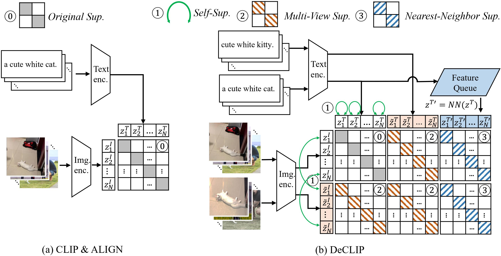

# DeCLIP
Supervision Exists Everywhere: A Data Efficient Contrastive Language-Image Pre-training Paradigm.

Our paper is available on [arxiv](https://arxiv.org/abs/2110.05208)


## Updates

** Our code, dataset and models will be relased soon**


## Introduction

Recently, large-scale Contrastive Language-Image Pre-training (CLIP) (Radfordet al., 2021) has attracted unprecedented attention for its impressive zero-shot recognition ability and excellent transferability to downstream tasks. However, CLIP is quite data-hungry and requires 400M image-text pairs for pre-training, thereby restricting its adoption. This work proposes a novel training paradigm, Data efficient CLIP (DeCLIP), to alleviate this limitation. We demonstrate that by carefully utilizing the widespread supervision among the image-text pairs, our DeCLIP can learn generic visual features more efficiently. Instead of using the single image-text contrastive supervision, we fully exploit data potential through the use of (1) self-supervision within each modality; (2) multi-view supervision across modalities; (3) nearest-neighbor supervision from other similar pairs. Benefiting from these intrinsic supervision, our DeCLIP-ResNet50 can achieve 60.4% zero-shot top1 accuracy on ImageNet, which is 0.8% above the CLIP-ResNet50 while using 7.1× fewer data. Our DeCLIP-ResNet50 outperforms its counterpart in 8 out of 11 visual datasets when transferred to downstream tasks. Moreover, Scaling up the model and computing also works well in our framework.




## Model 

<!-- **Model will be relased soon** -->

### Our pretrain visual backbone model (w/o text encoder)

DeCLIP_r50    [GoogleDriver](https://drive.google.com/file/d/1SZJ8CU5dDIwuvZWxb4xdld7qv7aw6wKm/view?usp=sharing).  
DeCLIP_vitb32 [GoogleDriver](https://drive.google.com/file/d/1W2cCxsr3EjvOOWzVXZukLk38c8LC6UUm/view?usp=sharing)

<!-- 
### Our pretrain visual backbone 

**Model will be relased soon**  -->


## Citing DeCLIP

```
@misc{li2021supervision,
      title={Supervision Exists Everywhere: A Data Efficient Contrastive Language-Image Pre-training Paradigm}, 
      author={Yangguang Li and Feng Liang and Lichen Zhao and Yufeng Cui and Wanli Ouyang and Jing Shao and Fengwei Yu and Junjie Yan},
      year={2021},
      eprint={2110.05208},
      archivePrefix={arXiv},
      primaryClass={cs.CV}
}
```
